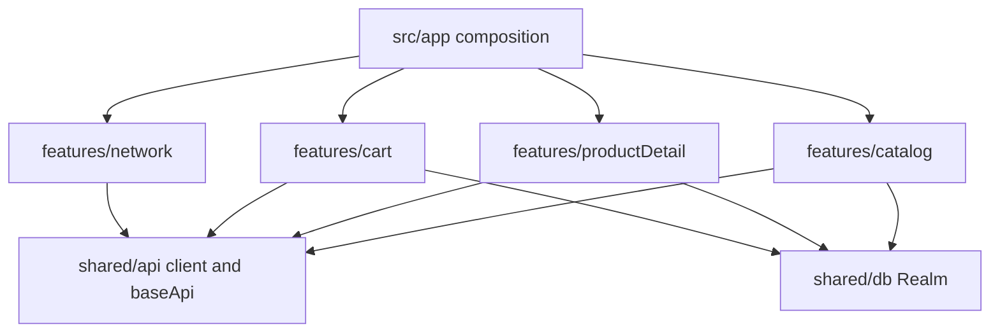

# Product Catalog Case Study

Build on the existing React Native 0.87 TypeScript app (`newArchEnabled=true`, Hermes). No camera, location, or other device-hardware APIs. Native modules are limited to ones this spec requires: Realm, NetInfo, navigation, and FlashList. The product list uses `@shopify/flash-list` v2.

## Stack

- **State and fetching:** Redux Toolkit (`@reduxjs/toolkit`) and RTK Query, with `react-redux`. One store holds the RTK Query cache and a `network` slice. UI reads that store and does not call `fetch` directly.
- **Persistence:** `realm` + `@realm/react`. Local Realm (no Atlas sync). The JS SDK opens a local file with `new Realm({ schema })` and uses TurboModules, which matches the new architecture already enabled in [android/gradle.properties](../android/gradle.properties).
- **List:** `@shopify/flash-list` v2. v2 requires the new architecture already enabled in this app, recycles cells, and sizes rows itself, so `estimatedItemSize` is not set. `onEndReached` loads the next page. Rows receive plain objects copied out of Realm, not live Realm objects. A memoized card, a stable `keyExtractor`, and a fixed thumbnail size keep recycled cells from doing extra layout work.
- **Network:** `@react-native-community/netinfo` dispatches into the `network` slice.
- **Navigation:** `@react-navigation/native` + native stack (`ProductFeed` → `ProductDetail`). `react-native-safe-area-context` is already installed.
- **Queued action:** Add to cart via `POST /carts/add`. The feature list does not name a mutation, but the banner and architecture brief require a persisted offline queue. Cart is the action that queue flushes.

## Architecture

Feature-based folders own screens, UI, and endpoints. A shared layer owns the pieces every feature uses: the HTTP client, the RTK Query `baseApi`, the Redux store, and Realm. Features reach each other only through a public `index.ts`. They do not import another feature's internals.



```
src/
  app/
    navigation/RootNavigator.tsx
    store/store.ts                 configureStore, hydrate, typed hooks
    bootstrap.ts                   open Realm, hydrate, start NetInfo before AppRegistry
  features/
    catalog/
      api/catalogApi.ts            injectEndpoints: getProducts, getCategories
      model/feedCache.ts           serializeQueryArgs, merge, query key
      model/types.ts
      data/schemas.ts              Product, Category, FeedSnapshot as plain schema objects
      components/                  ProductCard, SearchBar, CategoryFilter, SortControl
      screens/ProductFeedScreen.tsx
      index.ts
    productDetail/
      api/productDetailApi.ts      injectEndpoints: getProduct
      screens/ProductDetailScreen.tsx
      index.ts
    cart/
      api/cartApi.ts               injectEndpoints: addToCart, flushQueue
      data/queuedActionSchema.ts
      index.ts
    network/
      model/networkSlice.ts
      model/banner.ts              pure banner selector
      components/NetworkBanner.tsx
      lib/listenToNetwork.ts
      index.ts
  shared/
    api/client.ts                  fetch wrapper, base URL, no React or Redux
    api/url.ts                     product URL builder
    api/baseApi.ts                 createApi; features inject their endpoints
    db/realm.ts                    only file that imports realm
    db/repository.ts               repository interface plus Realm and in-memory implementations
    hooks/useDebouncedValue.ts
```

- [src/app](../src/app) wires navigation, the store, and startup. It imports feature public APIs only.
- [src/shared/api](../src/shared/api) is the DummyJSON client and the empty RTK Query `baseApi`. `queryFn` implementations live in the feature that owns the endpoint. No hand-written `createAsyncThunk`.
- [src/shared/db](../src/shared/db) opens the local Realm, registers the feature schema objects, and implements the repository. Feature `data/` files define schemas as plain objects and call repository methods. They do not import `realm`.
- [src/features/catalog](../src/features/catalog) owns the feed, search, category filter, and sort.
- [src/features/productDetail](../src/features/productDetail) owns the detail screen. Add to cart goes through [src/features/cart/index.ts](../src/features/cart/index.ts).
- [src/features/network](../src/features/network) owns the NetInfo listener, `network` slice, and banner.

Realm models (`schemaVersion: 1`):

- `Product` — primary key `id` (int). Fields used by the card and detail screen: `title`, `description`, `category`, `price`, `rating`, `thumbnail`, `brand`, `stock`, `imagesJson`. `imagesJson` is a string so the schema stays a single object type.
- `Category` — primary key `slug`. `name`, `url`.
- `FeedSnapshot` — primary key `queryKey` (string). `productIdsJson`, `total`, `skip`, `updatedAt`. One row per search/category/sort combination so infinite-scroll pages can be rebuilt.
- `QueuedAction` — primary key `id` (string). `type` (`addToCart`), `productId`, `quantity`, `createdAt`.

Writes go through `realm.write()` and `UpdateMode.Modified` so refetches upsert. Reads copy results to plain objects before they reach Redux or FlashList.

## Feature behavior

**Feed.** One RTK Query endpoint, `getProducts`, paginates with `limit=20` and `skip`. Infinite scroll uses the RTK Query cache-merge pattern:

- `serializeQueryArgs` drops `skip` so every page for the same search, category, and sort shares one cache entry
- `merge` appends `products` when `skip > 0`, and replaces the list when `skip === 0`
- `forceRefetch` returns true when `skip` changes

FlashList `onEndReached` dispatches the same endpoint with the next `skip` while `skip + limit < total`. `ProductCard` is memoized, `keyExtractor` is `String(id)`, thumbnail has a fixed size, and `renderItem` is a stable callback. `onQueryStarted` upserts `Product` rows and the `FeedSnapshot` after each fulfilled page.

**Search.** Local input updates immediately. A `useDebouncedValue` hook (400ms, inside the 300–500ms window) is the value passed into `useGetProductsQuery`, so typing does not hit the API on every keystroke.

**Filter and sort.** Category chips from `getCategories` (`GET /products/categories`, slug + name). Sort options: price ascending, price descending, rating descending. URL builder:

- category and no search text: `GET /products/category/{slug}`
- search text: `GET /products/search?q=`
- both: search endpoint, then keep items whose `category` matches the slug; `total`/`skip` still come from the search response so load-more continues
- sort via `sortBy` and `order` on every list request

Changing search, category, or sort changes the serialized cache key and restarts at `skip=0`.

**Cold start.** Before `AppRegistry` renders, open the local Realm synchronously, create the store, and `dispatch(api.util.upsertQueryData(...))` for the latest feed, categories, and any stored product details. First paint already has that data, so `isLoading` is false. Endpoints use `refetchOnMountOrArgChange: true`, so an online launch refetches in the background (`isFetching`) and upserts Realm. List presses also `upsertQueryData` for `getProduct` so detail opens from the row before `GET /products/{id}` returns. The detail response upserts the same `Product` primary key.

**Offline queue and banner.** Cart sync is two RTK Query mutations, not a separate thunk. `addToCart` writes a `QueuedAction` in Realm, then `POST`s `/carts/add` when the `network` slice says online and deletes that row only after success. When offline, the mutation returns `{ queued: true }` and leaves the row. NetInfo only dispatches `network/setOnline`. On the transition to online it dispatches `api.endpoints.flushQueue.initiate()` with a fixed cache key so only one flush runs at a time. `flushQueue` reads pending Realm rows, posts each one, and deletes a row only after its response succeeds. Failed rows stay for the next reconnect. `onQueryStarted` on `flushQueue` sets `network.status` to `syncing` until the mutation settles. The queue survives cold start because it is a Realm table, not Redux state.

Banner copy comes from a pure selector and is shown as a slim top bar:

- `online`: `Online`
- `offline`: `Offline - Serving Cached Data`
- `syncing`: `Syncing Queued Actions`

## Tests and hook

Jest + `@testing-library/react-native`. Tests sit next to the feature or shared module they cover. Coverage is collected from `src/**/*.{ts,tsx}` with a global threshold of 70% statements, branches, functions, and lines.

Realm’s native binary is not loaded in Jest. The repository is an interface; tests use an in-memory fake with the same methods. Production uses the Realm implementation. RTK Query tests use the real store with a mocked `fetch`. Jest mocks `@shopify/flash-list` with a list that renders rows, so integration tests can assert feed content without the native recycler.

- Unit: URL builder, debounce hook (fake timers), feed merge/`serializeQueryArgs`, snapshot-to-cache mapping, banner selector, queue enqueue/flush with the in-memory repository.
- Integration: feed renders hydrated cache before fetch resolves; search waits out the debounce; category/sort changes the request; banner switches with mocked NetInfo; add-to-cart queues offline and flushes when NetInfo reports online.

`npm run ci` runs ESLint, `tsc --noEmit`, and `jest --coverage --ci`. Husky `pre-commit` runs that same script so the hook matches CI. UI interaction coverage comes from Testing Library. A device e2e runner (Detox/Maestro) is left out; the spec marks e2e as optional and it would add another native toolchain.

## Docs and commits

Replace the boilerplate [README.md](../README.md) with iOS and Android run steps (Metro, `npm run ios`, `npm run android`, `bundle exec pod install` after native deps) plus a short architecture brief covering:

- feature folders for catalog, product detail, cart, and network, with shared API, store, and Realm layers
- synchronous local Realm open, plain-object hydrate into the RTK Query cache, then background revalidation that upserts Realm
- `QueuedAction` rows persisted in Realm and replayed by the `flushQueue` RTK Query mutation on reconnect
- FlashList v2 cell recycling on the new architecture, memoized rows, plain objects instead of live Realm results, fixed image size, and stable keys

Branch roles:

- `main` is production. It stays at the initial commit until every feature is on `master`. The last step merges `master` into `main` with a merge commit and pushes `main`.
- `master` is development. It already exists on `origin/master`. Do not commit feature work directly on `master`.
- Each remaining requirement gets its own feature branch cut from the latest `origin/master`. One commit on that branch, then push the branch and open a pull request into `master` with `gh pr create --base master`. Do not merge locally. `chore/catalog-dependencies` is already on `master` and does not get a second PR.
- The pull request is the review. Stop after opening it and send the PR URL, the commit subject, and what to look at. Do not merge it and do not start the next branch until the review is approved. When approved, merge on GitHub with a merge commit so the feature commit stays visible. Do not squash, amend, or force-push.

Commit subjects follow GitHub's limit: 50 characters or fewer, imperative mood, and no trailing period. A body is added only when the subject cannot carry the reason, and that body wraps at 72 characters. Each commit contains one slice and no unrelated files.

The history follows the original requirements one by one. Category list fetch is its own branch, commit, and pull request into `master`: `feat: fetch product categories`, for `GET /products/categories`. It is not folded into the client, the feed, or the filter branch. Product pagination, search, and product details each get a branch and a pull request whose commit subject names that fetch. Husky is the last branch, so the pre-commit hook does not block the earlier pull requests.

Branch order, each with one commit:

1. `chore/catalog-dependencies` — `chore: add catalog dependencies`. Package install already in the working tree, plus CocoaPods.
2. `feat/redux-store` — `feat: add the Redux store`. `baseApi`, `configureStore`, and typed hooks.
3. `feat/paginated-products` — `feat: fetch paginated products`. `GET /products?limit=20&skip=0`.
4. `feat/product-categories` — `feat: fetch product categories`. `GET /products/categories`, the category type, and the RTK Query endpoint.
5. `feat/product-search` — `feat: search products by query`. `GET /products/search?q=`.
6. `feat/product-details` — `feat: fetch product details`. `GET /products/{id}`.
7. `feat/realm-cache` — `feat: cache catalog in Realm`. Persist products, the category list, and product details.
8. `feat/cold-start` — `feat: hydrate catalog on launch`. Render the cached catalog, then revalidate.
9. `feat/virtualized-feed` — `feat: add virtualized product feed`. FlashList and `skip`/`limit` infinite scroll.
10. `feat/debounced-search` — `feat: debounce product search`. 400ms search-as-you-type.
11. `feat/filter-sort` — `feat: filter and sort the feed`. Category, price, and rating.
12. `feat/detail-screen` — `feat: add product detail screen`. Detail route seeded from the list cache, with add to cart.
13. `feat/network-banner` — `feat: show network status banner`. Online, Offline - Serving Cached Data, Syncing Queued Actions.
14. `feat/offline-cart` — `feat: queue offline cart actions`. Realm queue flushed by the `flushQueue` mutation on reconnect.
15. `test/catalog-coverage` — `test: cover catalog behavior`. Unit and integration tests and the 70% coverage gate.
16. `chore/hook-and-readme` — `chore: add hook and README`. Husky, `npm run ci`, and the architecture brief.
